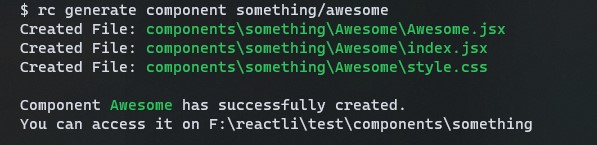

# <div style='text-align: center'>Reactli <small>(under development)</small></div>

The New CLI tool **explicitly** for react.

This is a CLI tool similar to [@angular/cli](https://www.npmjs.com/package/@angular/cli). The main purpose of this is, to create short-cuts for all the boilerplate code you've to run when you are developing a react application.

I am hoping to expand this more so you will be able to,

- Generate components
- Generate stylesheets (css, scss, styled-components and many more)
- install npm packages
- run your application
- Lint your application
- run tests with 0 configuration

## Features

- Fully customizable templates
- to be supported to wide range of apps
  - Create React App
  - NextJS
  - Gatsby
  - React with Vite
  - and more

## Here's the first look



## Get started

Add this cli globally to your PC.
<br>Run:

```
$ npm install reactli -g
```

To create a new component

```
rc g c <component_name>
```

_That's it!_

I am hoping to develop this to the next level. so you can help me with just giving a 🌟 to this repo

## Author

- Website - [dulranga.ml](https://www.dulranga.ml)
- Frontend Mentor - [@dulranga](https://www.frontendmentor.io/profile/dulranga)
- Twitter - [@dulrangaD](https://www.twitter.com/dulrangaD)
