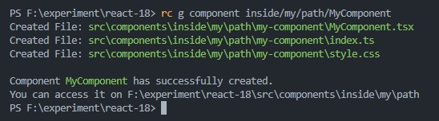

# Generate Snippets

## Syntax

```bash
rc g <snippet> <name>
```

These are the snippets you can generate.

| Snippet     | Alias | Description                                     | `<name>`  |
| ----------- | ----- | ----------------------------------------------- | :-------- |
| `component` | `c`   | Create React component with styles, test files. | CamelCase |
| `hook`      | `h`   | Create React hook with given name .             | CamelCase |

:::info Custom Paths
You can create snippet inside of custom paths by prefixing the component name with the relative path.
Ex:

```bash
rc g component inside/my/path/MyComponent
```

The component files will be generated under `src/components/inside/my/path`



:::

:::tip

You don't need to enter "use" in the `<name>` when you are creating a react hook.
Reactli will automatically add that for you

```bash
rc g h useHelloHook
```

```bash
rc g h HelloHook
```

Both of these examples are equal.

:::
